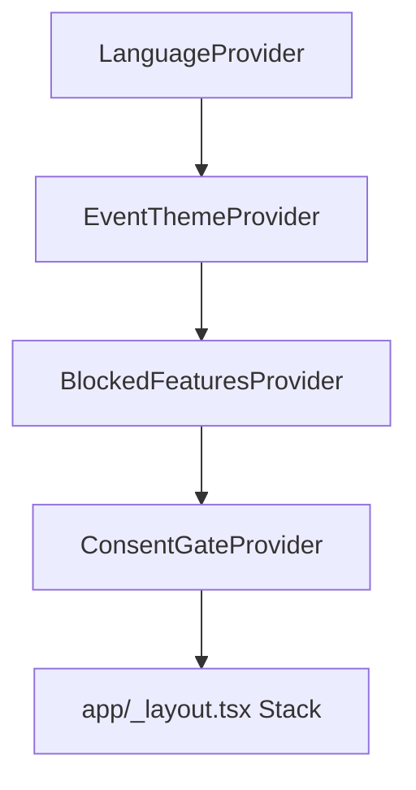
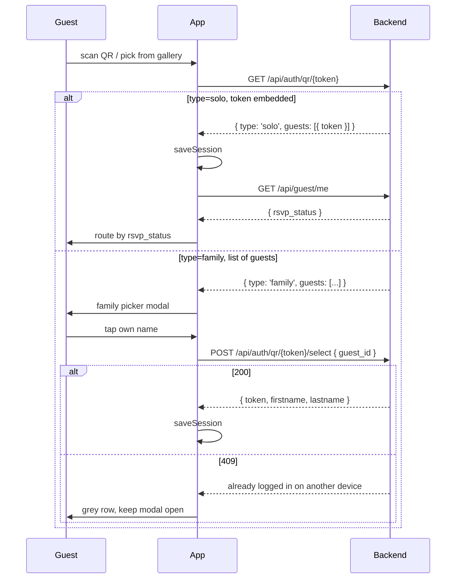

# Architecture

This document is the fast reference for anyone opening the repository for the
first time. It is written for a reviewer with React Native / TypeScript
experience; it does not re-explain Expo Router or NativeWind, but it does
explain every non-obvious choice this app makes on top of them.

For product context (what a "guest" is, who scans what, and why guest access
has no password) start with `README.md`. For legal / DSGVO reasoning start with
`docs/dependencies.md`, `docs/storage-keys.md` and the in-app privacy notice.
For historical reasoning behind the refactor phases start with
`docs/REFACTOR_PLAN.md`.

## 1. One-paragraph summary

The app is a small Expo Router client that talks to a Laravel backend. A
guest scans the invitation card's QR code and lands in a tab layout that
mirrors the wedding weekend. An organizer instead redeems a one-time
event-scoped device-pairing QR code generated from an authenticated web account.
Guest and organizer bearer sessions are deliberately mutually exclusive; one
Organizer device session is pinned to one event. Guest and Organizer route groups
share the same event-themed tab shell; the Organizer manifest is always Overview,
Schedule, Photos, Tasks and Settings for every organizer role. Everything else
(theme colours, event info, photos, drink logs) flows down from the backend at runtime.

## 2. Runtime layers

```
+---------------------------+     +--------------------------+
|  Expo Router (file-based) |     |  Laravel 12 + Sanctum    |
|  app/**/*.tsx             |<--->|  hommrich.app (prod)     |
|                           | HTTP|  beta.hommrich.app (stg) |
+-------------+-------------+     +--------------------------+
              |
              v
+---------------------------+     +--------------------------+
|  Providers (context tree) |     |  OS-native primitives    |
|  Language / Theme / Blocks|     |  Keychain / Keystore     |
|  / ConsentGate            |     |  Camera / Photo library  |
+-------------+-------------+     +--------------------------+
              |
              v
+---------------------------+
|  lib/** (pure TS modules) |
|  api / auth / guest /     |
|  legal / consents / ...   |
+---------------------------+
```

Every layer only calls the ones directly below it. Screens never touch
`SecureStore` themselves — they go through `lib/auth.ts`. Screens never open
raw `fetch` — they go through `lib/api.ts`. Screens never lift theme colours
from `EventInfo` — they read `useEventTheme().colors`. Breaking this rule is
a code-review reject reason.

## 3. Provider tree

The four providers in `app/_layout.tsx` are ordered so each one can call the
one above it during its own initialisation:



1. **`LanguageProvider`** (`lib/LanguageContext.tsx`) — outermost so any error
   inside another provider can still render a translated fallback.
2. **`EventThemeProvider`** (`lib/EventThemeContext.tsx`) — needs the language
   layer for `Accept-Language` on its first fetch; selects Guest event-info or
   the bound Organizer event theme and clears stale theme state on logout.
3. **`BlockedFeaturesProvider`** (`lib/BlockedFeaturesContext.tsx`) — polls
   for `drinks_blocked` state, registers a handler with `lib/api.ts`.
4. **`ConsentGateProvider`** (`components/ConsentGate.tsx`) — hosts the
   consent modal, so the modal renders on top of every route including the
   splash overlay.

## 4. Authentication flow

Two-step to accommodate families arriving on one invitation card:



`app/index.tsx` implements both paths. `lib/guest.ts::isFullAccess` /
`isDeclinedFlow` centralise the rsvp-status → route mapping so the redirect
matrix cannot drift between the session probe and the post-login path.

Organizer access is a separate session type reached through the same scanner.
`app/scan.tsx` recognizes the token contract before making a request: Guest
invitation tokens are 32 characters, while one-time Organizer pairing secrets
are 64 alphanumeric characters. This prevents a management secret from being
sent in a Guest-auth URL. `lib/management.ts` stores the organizer identity and
the event id returned by pairing, then requires `GET /api/management/me/events`
to return exactly that one bound event. Saving
either session type deletes the other one, preventing a guest token from ever
being sent to the management API (or vice versa). Organizer login is QR-only;
there is no native or backend password-token path.

Organizer push is explicit opt-in. The install-level preference survives logout, while every Expo
token is server-bound to exactly one expiring management bearer and event. A successful logout therefore
cascade-revokes delivery. If logout is offline, the interactive session is cleared but a dedicated,
non-interactive bearer copy retries server revocation on later starts. Expo token rotation updates
the same server device context. Cold-start notification routing is consumed by the welcome-session
probe before its default organizer redirect, so the deep link cannot be overwritten.

## 5. Screens and their non-obvious rules

| Route                        | Purpose                                       | Non-obvious rule                                                                                                                                                           |
| ---------------------------- | --------------------------------------------- | -------------------------------------------------------------------------------------------------------------------------------------------------------------------------- |
| `app/index.tsx`              | Welcome + session probe + gallery-QR fallback | Also probes for a pending Art. 17 erasure — if one exists we route to `/erasure-pending` without showing the welcome screen.                                               |
| `app/scan.tsx`               | Shared Guest/Organizer QR scanner             | Distinguishes the fixed 32-character invitation and 64-character pairing contracts locally, then opens the matching session flow.                                          |
| `app/organizer/_layout.tsx`  | Five-tab Organizer shell                      | Uses the same `EventTabShell` and event theme as Guest; role differences are actions inside screens, never separate navigation.                                            |
| `app/organizer/index.tsx`    | Bound Organizer overview                      | Displays the single paired event read-only, exposes explicit push opt-in/out, and returns missing or expired sessions to the shared welcome scanner.                       |
| `app/organizer/notes.tsx`    | Organizer notes and ToDos                     | Mirrors server-side visibility: assignees may check off assigned ToDos, while assignment and deletion remain limited to the authoritative role policy.                     |
| `app/organizer/photos.tsx`   | Administrative gallery                        | Views all three albums with shared grid/detail primitives; generic upload is limited to `app_gallery`/`presentation`, while `photo_game` stays assignment-aware.           |
| `app/organizer/schedule.tsx` | Complete read-only schedule                   | Uses the shared timeline presentation with the dedicated management adapter; no schedule mutation call exists in the native app.                                           |
| `app/organizer/settings.tsx` | Generic app settings                          | Reuses Guest language/legal/logout rows but deliberately excludes Guest export, erasure, visibility and consent-management actions.                                        |
| `app/rsvp.tsx`               | First-time RSVP after login                   | The tab bar is not yet mounted here — this is the one place where a full-screen route sits outside `(tabs)`.                                                               |
| `app/declined.tsx`           | Declined guest surface                        | Offers revocation. Known issue: `useSafeAreaInsets` is called after an early return (see `docs/REFACTOR_PLAN.md` follow-ups).                                              |
| `app/blocked.tsx`            | Global app-block screen                       | Polls the backend for re-enable and calls `clearBlocked()` from `lib/api.ts` before navigating home.                                                                       |
| `app/(tabs)/home.tsx`        | Landing tab                                   | Cover image + countdown + tap-to-navigate venue. `openInMaps` prefers coordinates over addresses because `geo:lat,lng?q=<addr>` on Android silently drops the coordinates. |
| `app/(tabs)/rsvp.tsx`        | Group RSVP tab                                | Only visible when `rsvp_status === 'accepted_pending'`. Tab visibility is a static prop in `_layout.tsx`.                                                                  |
| `app/(tabs)/photos.tsx`      | Gallery + upload + UGC moderation             | Shared gallery primitives use an album-shaped model, but the Guest capability exposes only `app_gallery`; reporting/hide controls remain Guest-only.                       |
| `app/(tabs)/photo-game.tsx`  | Foto-game with 4 states                       | Submit button wrapped in `<ConsentGate purpose="photo_game">`.                                                                                                             |
| `app/(tabs)/drinks.tsx`      | Drink log + ranking                           | Hidden when the backend flips `drink_game_enabled: false`.                                                                                                                 |
| `app/(tabs)/settings.tsx`    | Logout, language, legal/DSGVO surfaces        | Legal rows keep the conventional DE order: Impressum before Datenschutz, then consent/export/erasure.                                                                      |
| `app/legal/imprint.tsx`      | § 5 DDG imprint                               | Reads through a 24 h SecureStore cache so legal contact info remains available offline.                                                                                    |
| `app/legal/privacy.tsx`      | Art. 13 privacy notice                        | Reads through a 24 h SecureStore cache so airplane-mode still shows text.                                                                                                  |
| `app/consents/index.tsx`     | Art. 7 (3) consent management                 | Lists granted consents with timestamps; revocation is one tap.                                                                                                             |
| `app/data-export.tsx`        | Art. 15 export                                | Streams the JSON to `expo-sharing` — never lands on disk unencrypted.                                                                                                      |
| `app/hidden-guests.tsx`      | Private content-hide management               | Lists guests whose photo content the current guest has hidden; unhide is local-to-this-guest and server-backed.                                                            |
| `app/erasure-pending.tsx`    | Art. 17 in-window state                       | Reachable without a session so a guest can always revoke.                                                                                                                  |

## 6. Design system

Two layers with a strict "consult in this order" rule:

1. **`constants/theme.ts`** — static tokens. Spacing, border radius, semantic
   colours (`error`, `sage`, `muted`). Never overridden by the backend.
2. **`useEventTheme().colors`** — dynamic brand palette from Guest event-info
   or the bound Organizer theme block. Every user-facing colour that could
   plausibly change per event lives here; there is no Organizer palette fork.

`components/EventTabShell.tsx`, `components/ScheduleTimeline.tsx`,
`components/GenericAppSettingsRows.tsx` and `components/gallery/**` are the shared
presentation boundary. Guest and management API adapters remain separate so
reusing presentation never broadens an actor's server capabilities.

Hard-coded hex values inside screens are forbidden. The colour role table in
`CLAUDE.md` lists every field and its intended use.

Fonts follow the same pattern: 10 Google Fonts are bundled locally (no CDN
at runtime — deliberately, DSGVO), the active font is a backend key, and
`ThemedText` transparently swaps the family so screens never touch
`fontFamily` themselves.

## 7. Persistence and state

Two persistence layers:

- **`expo-secure-store` (Keychain / Keystore)** — bearer tokens, the non-secret
  `session_id`, guest/organizer identity and preference keys. Every key is
  documented in `docs/storage-keys.md`. The hot-path token/scope reads go through
  the in-memory write-through cache in `lib/sessionCache.ts` (SecureStore stays
  the source of truth; the cache is only an accelerator + reactivity layer).
- **`@react-native-async-storage/async-storage` — TanStack Query cache
  (`lib/queryPersistence.ts`, CP6).** A persisted, offline-capable copy of a
  **strict allowlist** of non-sensitive, session-scoped query results
  (`eventInfo`, `photos`, `managementEvents`,
  `managementSchedule`). This is the app's only on-disk data cache. GDPR
  guarantees: (a) auth/session-derived and non-allowlisted queries never touch
  disk; (b) every persisted entry keeps its full query key which embeds the
  non-secret `QueryScope` (actor + id + `sessionId`), so a new login (new
  `sessionId`) can never surface another account's data; (c) `purgePersistedCache()`
  wipes memory **and** disk on logout, account switch, and GDPR erasure; (d) a
  `maxAge` (24h) + version `buster` discard stale/old-schema caches. Beyond this
  there is no `localStorage` and no on-disk cache except `expo-image`'s
  OS-managed image cache.

Runtime state is React state, held either in a screen or in one of the
providers, plus the TanStack Query cache for server data. There is no Redux /
Zustand / MobX in the tree, and every mid-mount async lookup goes through
`lib/*` so mocking in tests stays surgical.

## 8. Networking

`lib/api.ts` is the only axios instance in the app. It selects the guest or
organizer bearer via request interceptor (freshly read from SecureStore on
every call so a mid-session logout takes effect immediately). Management
requests also receive the persisted, pairing-bound `X-Event-ID`, except for
bootstrap endpoints such as `GET /api/management/me/events`. A management
401 clears only the organizer session and routes back to the shared welcome
screen and scanner.
`lib/managementPush.ts` registers the Expo installation token only for an
organizer session, unregisters it during online logout, and opens an
`assigned_note` only when its event matches the bound session. Notification
taps never switch events.
The response interceptor also translates two backend "soft blocks" into
global side-effects:

- `app_blocked` (403) → route to `/blocked` once, swallow the rejection so no
  screen surfaces a duplicate alert.
- `drinks_blocked` → notify `BlockedFeaturesContext` and swallow.

Other errors bubble to the caller. Every screen that fetches on mount catches
its own errors and keeps the last-known good render — networks fail on
wedding weekends and the UI should not blank out.

## 9. DSGVO / privacy design

Compliance surfaces are additive on the app side; the substantive text lives
on the backend so a legal edit does not require a store submission.

- **Art. 13 (transparency)** — `app/legal/privacy.tsx` renders backend
  markdown, cached 24 h in `expo-secure-store`.
- **Art. 6/7 (consent)** — `components/ConsentGate.tsx` wraps every
  processing surface (upload, photo-game submission, camera scan). Consents
  are stored per purpose with a granted-at timestamp (the Art. 7 (1) burden
  of proof) and revocable in `app/consents/index.tsx`.
- **Art. 15 (export)** — `app/data-export.tsx` calls
  `GET /api/guest/export` and shares the JSON via `expo-sharing`.
- **Art. 17 (erasure)** — `app/erasure-pending.tsx` gates a 30-day soft
  delete window with in-app revocation.
- **Data minimisation** — `tests/regressions/no-tracking.test.ts` fails CI if
  any known analytics / crash-reporting SDK sneaks into `package.json`.
- **Fonts** — 10 Google Fonts locally bundled, no CDN traffic at runtime
  (see `docs/dependencies.md`).
- **Vendored `jsqr`** — the gallery-based QR decoder used to pull jsQR from
  `cdn.jsdelivr.net`; the library is now bundled offline
  (`lib/vendor/jsQRSource.ts`, regenerated by `scripts/vendor-jsqr.mjs`).
  The regression test also fails on any public-CDN hostname reappearing in
  the source tree.

## 10. Testing strategy

The suite is not a coverage-percentage race. The rule is: every regression
that could reach a guest or organizer phone should have a fair chance of failing here
first.

- **`lib/**` and `constants/**`** — pure logic, ≥ 90 % lines.
- **`app/**`** — one happy path plus one plausible failure per screen. The
  60 % floor is set at today's coverage; the 80 % target is tracked in
  `docs/REFACTOR_PLAN.md → Follow-ups` for the flows that still need a
  picker-plus-uploader harness (`photos`, `photo-game`).
- **`regressions/`** — repo-wide invariants (no tracking SDK).

Native module internals (`expo-camera`, `expo-image-picker`) are not tested;
the mocks in `tests/setup.ts` only substitute the JS interface. Visual
snapshots are deliberately not used — they rot faster than they help on a
dynamic-theme app.
